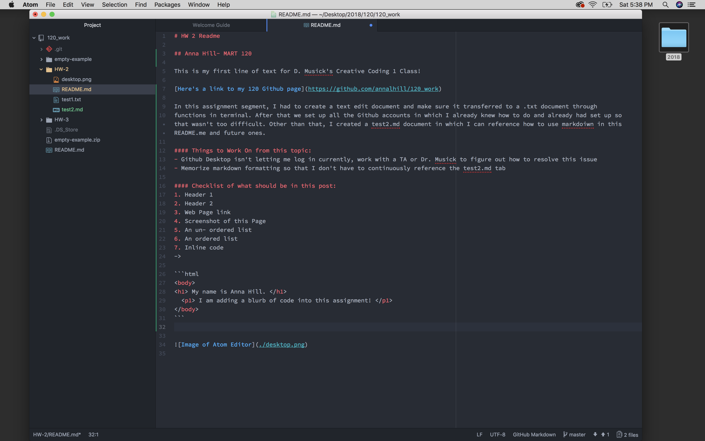

# HW 2 Readme

## Anna Hill- MART 120

This is my first line of text for D. Musick's Creative Coding 1 Class!

[Here's a link to my 120 Github page](https://github.com/annalhill/120_work)

In this assignment segment, I had to create a text edit document and make sure it transferred to a .txt document through
functions in terminal. After that we set up all the Github accounts in which I already knew how to do and already had set up so that wasn't too difficult. Other than that, I created a test2.md document in which I can reference how to use markdoiwn in this README.me and future ones.

#### Things to Work On from this topic:
- Github Desktop isn't letting me log in currently, work with a TA or Dr. Musick to figure out how to resolve this issue
- Memorize markdown formatting so that I don't have to continuously reference the test2.md tab

#### Checklist of what should be in this post:
1. Header 1
2. Header 2
3. Web Page link
4. Screenshot of this Page
5. An un- ordered list
6. An ordered list
7. Inline code
->

```html
<body>
<h1> My name is Anna Hill. </h1>
  <p1> I am adding a blurb of code into this assignment! </p1>
</body>
```



