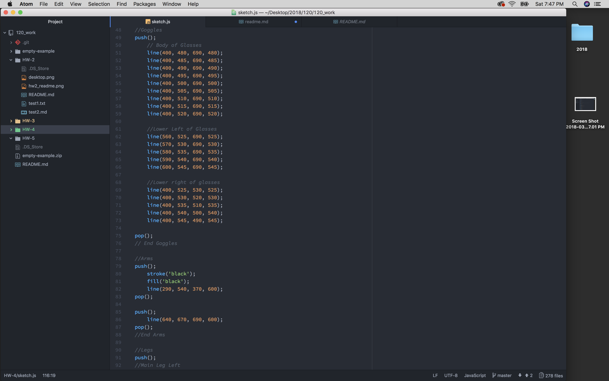

# HW 4 README.md

## Anna Hill- MART 120

### Progress Notes:
- So far I am getting a hang of making shapes and introducing elements of draw into my sketch
- My biggest issue was figuring out how translate would work and simply having to analyze the canvas to understand where the points would begin and end again. This was especially difficult when I wanted to add lines in. Thus far, the lines aren't showing up but in time I'll figure it out!
- I am overall trying to draw a picture of a snowball yeti- he's a snowball because he is more round than furry
- My yeti's name is Lars and he is one of my favorite characters to try and make whenever I have character assignments.
- Lines should involve 4 variables (x1, y1, x2, y2)
- I did it! Meet Lars the snowball yeti!

## Code:

## Lars:

