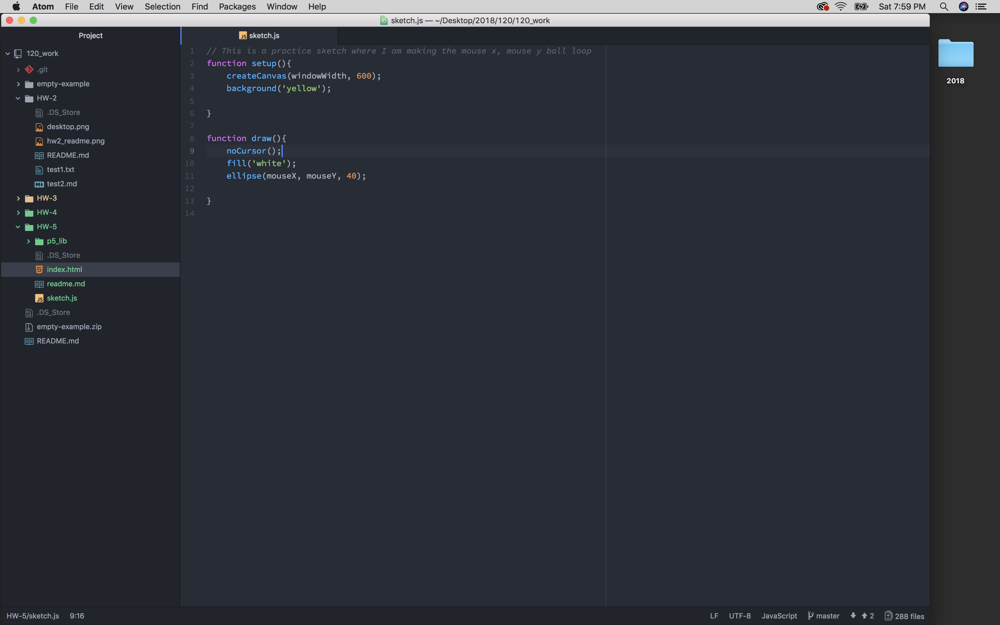
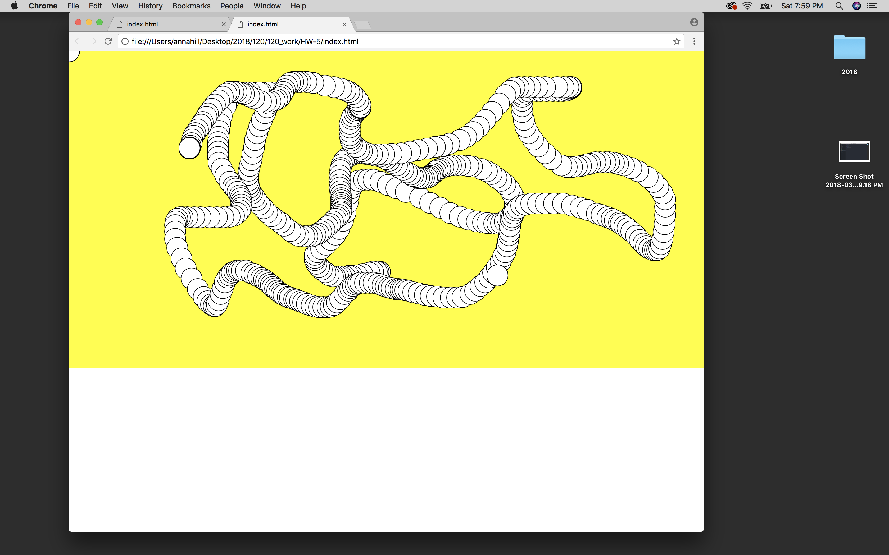

# HW 5

## Anna Hill- MART 120

### Here is my work when I practiced the looping ellipse code example!

### Progress
- I started with my original set of code that created Lars the Snowball Yeti because I wanted to be able to make him roll back and forth on the screen with the mousePressed function
    - I mean (mouseX, mouseY)... Processing and P5 get me confused!
- It was going great with the first few steps however my code doesn't work when I open it in the web browser (using Chrome)
- I am going to take a break and re-approach this lesson later
